# Predictive Test Selection

This document should be read as an investigation and execution strategy rather than a final architecture.

Without access to Buildkite's datasets, customer usage patterns, and existing Test Engine infrastructure, I would not assume that any particular modelling approach is correct.

Instead, I would begin by answering a series of questions:
```
- Where does the predictive signal actually come from?
- Historical co-failure patterns?
- Coverage information?
- Dependency graphs?
- Diff characteristics?
- What incremental value does machine learning provide beyond those baselines?
- What level of safety is required for customer trust, and how does that translate into measurable recall targets?
- How can the system generalise across repositories, languages, frameworks, and customers while remaining operationally simple?
```
The architecture described in this document reflects my current hypotheses about how I would approach those questions and the trade-offs I would expect to evaluate. 
These hypotheses would ultimately be validated or rejected through experimentation, offline evaluation, and staged production rollouts.

Note: This repository contains a design proposal exploring how I would approach predictive test selection at Buildkite. It is intentionally focused on architecture, trade-offs, and execution strategy rather than production code/implementation details.

### Why I'm Interested in This Problem

Predictive test selection sits at the intersection of several areas where I have spent most of my career:

- Search and ranking systems
- Production ML platforms
- Experimentation and evaluation frameworks for LLMs
- Low-latency inference systems
- CI/CD and developer tooling

What makes this problem particularly interesting is that it is not fundamentally an LLM problem. It is a *relevance problem.*

Given a code change, we want to determine which tests are most relevant to execute while maintaining a very high level of confidence that real failures are not missed. 
That introduces the same kinds of challenges found in large-scale search and recommendation systems:
```
- Sparse and noisy signals
- Recall vs efficiency trade-offs
- Cold-start behaviour
- Online evaluation and feedback loops
- Trust and explainability
- Strict latency requirements
```

Now, without further ado...

## Index

1. [Executive Summary](#1-executive-summary)
2. [Problem Statement](#2-problem-statement)
3. [What We Are Optimising](#3-what-we-are-optimising)
4. [Why Not Just Use Rules, Regex, or a Dependency Graph?](#4-why-not-just-use-rules-regex-or-a-dependency-graph)
5. [Solution Overview](#5-solution-overview)
6. [Triggers and CI Integration](#6-triggers-and-ci-integration)
7. [End-to-End Architecture](#7-end-to-end-architecture)
8. [Data and Curation](#8-data-and-curation)
9. [Feature Engineering and Multi-Language Coverage](#9-feature-engineering-and-multi-language-coverage)
10. [The ML Approach and Its Trade-offs](#10-the-ml-approach-and-its-trade-offs)
11. [Serving and Inference](#11-serving-and-inference)
12. [Evaluation: Offline and Online](#12-evaluation-offline-and-online)
13. [Failure Modes and Fallbacks](#13-failure-modes-and-fallbacks)
14. [Feedback Loops and Continuous Improvement](#14-feedback-loops-and-continuous-improvement)
15. [Scalability](#15-scalability)
16. [Observability and Monitoring](#16-observability-and-monitoring)
17. [The Cold-Start Problem](#17-the-cold-start-problem)
18. [MVP and Phased Roadmap](#18-mvp-and-phased-roadmap)
19. [Risks and Open Questions](#19-risks-and-open-questions)
20. [Appendices](#20-appendices)

---

## 1. Executive Summary

### The problem

Most teams run their entire test suite on every code change, so engineers wait 30, 60, or 90+ minutes for feedback as the codebase grows. The catch is that a typical change touches a tiny part of the code, so almost none of those tests were ever going to fail. We pay for the full suite to learn what a small, well-chosen subset could have told us almost immediately. That tax shows up as slower releases, a worse developer experience, and bugs caught late.

### Why the obvious fixes fall short

The instinct is to write path rules: if a file in `payments/` changed, run the `payments/` tests. That works until a change to a shared utility breaks tests in five unrelated modules that no path rule anticipated. A static dependency graph gets you further, but its transitive closure is so large that you barely save anything, and it cannot learn that `test A` has broken every time `file B` changed over the last six months, even when there is no direct import relationship. 

Rules tell you what could be related. History tells you what actually fails together. That gap is where ML earns its place.


### The bet

If we can model the link between a code change and which tests fail, we can run only the tests that matter. That turns a slow outer loop (run everything, wait) into a fast inner loop (run what is relevant, get an answer). For many teams, faster feedback is the difference between shipping daily and shipping weekly.

### What this system does

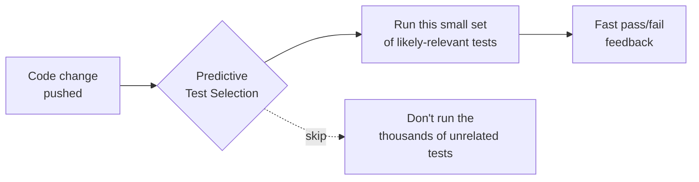

### The principle everything hangs on

It has to be safe. A selection system that occasionally lets a real bug through is worse than useless, because once trust is gone the team goes back to running everything. So the system fails safe. When it is unsure, when something breaks, or when it has never seen a repo before (cold start), it runs more tests, not fewer. We would rather waste some compute than miss a real failure.

### What good looks like

- We skip a large fraction of tests on the average change. That is the saving.
- We almost never miss a test that would have failed. That is the safety guarantee.
- The decision is fast enough to sit in the critical path. It cannot add more delay than it saves.
- It works across many languages and frameworks, not just one.


The line rises steeply at the start and then flattens. Running the first 30% of the suite (the tests the ranker is most suspicious of) already catches about 95% of failures. To squeeze out the last few percent of recall you have to run most of the rest of the suite, which buys very little. That flat tail is the waste predictive selection removes.

The dial is the recall target. Set it to 95% and most teams run roughly 30% of their tests and skip the other 70%. Set it to 99% for a merge to main, or down to 85% for a fast inner loop while developing. The always-on safety margin from earlier still sits on top of whatever cutoff is chosen.

---

## 2. Problem Statement

### Informal

Given a code change, pick the smallest set of tests that still catches all (or nearly all) the tests that would have failed.

### Formal

For a code change `C`, the full suite is a set of tests `T = {t1, t2, ... tN}`. When the full suite runs, some subset `F ⊆ T` actually fails because of `C`. We do not know `F` in advance. That is what running the tests tells us.

The system predicts a selected set `S ⊆ T` to run, where:

- `S` contains as many of the truly failing tests `F` as possible (safety),
- `S` is as small as possible (savings), and
- the prediction lands inside a strict time budget (latency).

The tension between these three is the whole problem. Select everything and you are perfectly safe but save nothing. Select nothing and you save everything but catch nothing. The job is to find the sweet spot and stay honest about where on that curve we are.

### Why it is hard

- **The signal is rare and noisy.** Most tests pass on most changes. Failures are the exception, and learning from rare events is genuinely hard.
- **Tests lie sometimes.** A flaky test fails for reasons unrelated to the change, such as timing, network, or randomness. Treat that as "the change caused it" and the model learns the wrong thing.
- **Code is not one language.** A general solution has to handle Python, Ruby, Go, JavaScript, Java, and more, each with different structure.
- **It has to be fast.** This sits in the critical path of every build. If selecting tests takes longer than running them, we made things worse.
- **New repos and tests have no history.** We often have to decide well with little or no past data. This is the cold start.

---

## 3. What We Are Optimising

### The three quantities

| Quantity | Plain meaning | We want it to be |
|---|---|---|
| **Safety (recall on failures)** | Of the tests that would have failed, what fraction did we run? | Close to 100%. A hard floor, not a nice-to-have |
| **Savings (selection rate)** | What fraction of the suite did we skip? | As high as possible. This is the reward |
| **Latency** | How long does the decision take? | Under a strict budget. A hard constraint |

### How they relate

Safety and savings pull against each other. Skip more tests and you save more, but you raise the chance of skipping one that would have failed. The trade-off is a curve, and the business decides where on it to sit.

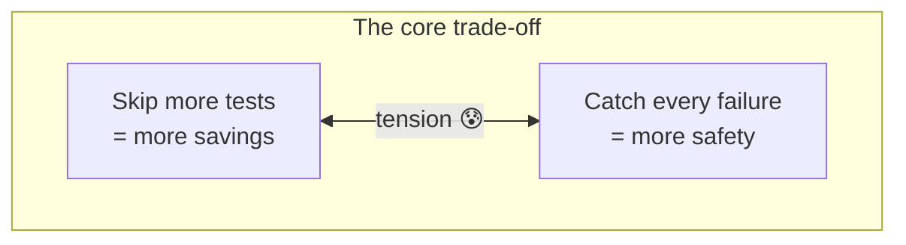

### The objective as a rule

> Maximise the fraction of tests we can safely skip, while keeping safety above an agreed floor and staying inside the latency budget.

In practice we set a safety target, for example "catch at least 99.x% of failures", then push savings as high as the model allows without breaching it. The safety target is a product and trust decision, not a purely technical one, so it is set deliberately and reviewed.

### The metric we watch hardest: escaped failures

An escaped failure is the bad case. A test would have failed, we skipped it, and the build went green when it should have been red. This is what makes or breaks trust. We measure it constantly (see [Evaluation](#12-evaluation-offline-and-online)) and treat any unexpected rise as an incident.

### What we do not optimise

- **Not individual tests.** We are not making one test faster or less flaky. We are building general selection that works across suites.
- **Not average speed at the cost of worst-case safety.** A system that is fast 99% of the time but leaks bugs 1% of the time fails the trust test.

---

## 4. Why Not Just Use Rules, Regex, or a Dependency Graph?

A fair question: why bring ML into this at all, when you could write rules? Worth answering head on, because the simple approaches are exactly what a good system has to beat, and they become our baseline (see [ML Approach](#10-the-ml-approach-and-its-trade-offs)).

### Approach A: path or regex rules

Example: "if a file in `payments/` changed, run the `payments` tests."

| | |
|---|---|
| **What it is** | Hand-written rules mapping file paths to test paths |
| **Why it tempts** | Simple, transparent, no training |
| **Why it breaks** | Someone has to write and maintain rules for every project, which does not scale across thousands of repos. It misses cross-cutting links, where a change to a shared utility or config breaks tests far away. And it is either too broad (run a whole folder, save little) or too narrow (miss real failures), with no principled way to tune. |

### Approach B: static dependency graph

Example: build a graph of what imports or calls what, then if you change file X, run every test that reaches X.

| | |
|---|---|
| **What it is** | A graph of code relationships used to trace impact |
| **Better because** | It captures real code relationships, not just folder names |
| **Still not enough** | It over-selects, because dependency closures are huge and a change to a core module reaches most of the suite, so you save little. It misses runtime and implicit links that static analysis cannot see, such as dependency injection, reflection, config-driven behaviour, and fixtures. It ignores history, so it cannot learn that a checkout test is empirically fragile whenever the tax module changes. And accurate graphs are expensive to build per language. |

### The honest case for path filtering, and its four limits

For a small, well-structured monorepo, a rule like "changes under `payments/` only run `tests/payments/`" is simple, auditable, and has zero latency. Many teams do this and it works. We should say so plainly. ML earns its place only because four things break path filtering at scale.

| Limit | What goes wrong |
|---|---|
| **Cross-cutting changes** | A change to a shared utility, base class, or config parser can break tests in ten unrelated modules. A path rule cannot know which without an enormous, fragile rule set, so it runs too much or misses failures |
| **Rule maintenance burden** | Every new module, folder rename, or refactor needs the rules updated. Across thousands of customer codebases we have no visibility into, nobody can own that. The model learns the structure from observed failures instead |
| **Indirect dependencies** | Test A fails when file B changes, but A and B sit in different directories with no naming link. This is constant with ORMs, serializers, and anything using dynamic imports or metaprogramming. Path filters are blind to it |
| **Generalisation across customers** | We cannot ask each customer to reorganise their repo to suit our tool. The model has to generalise to whatever structure exists |

Path filtering is still a fine cold-start heuristic, so it belongs in the fallback strategy. A slightly smarter version, the coverage heuristic (run the tests that import the changed files), is strictly better than raw path matching and still needs no historical data. See [Cold Start](#17-the-cold-start-problem).

### Why ML

The dependency graph tells you what could be related. History tells you what actually fails together. ML combines both, structural signals and empirical co-failure patterns, and learns a tuneable trade-off instead of a brittle yes or no. It also puts a calibrated confidence on each decision, which is what makes safe fallback possible.

> **Stance:** we do not throw the rules away. Regex and dependency-graph signals become features and baselines. ML's job is to beat them reliably and to know when it cannot.

---

## 5. Solution Overview

There are three planes. 
- The CI side, where changes happen and tests run. 
- The serving side, which answers "what should I run?" fast. 
- The learning side, which turns past results into better models, offline.

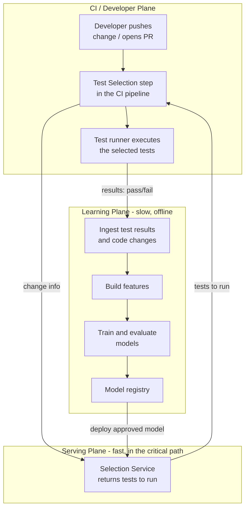

A change flows into the selection step, which asks the service what to run. The runner runs those tests and reports results. Those results feed the learning plane, which improves the model and, after evaluation, promotes a better one back into serving. The loop closes. The rest of the document drills into each piece.

---

## 6. Triggers and CI Integration

### When does selection happen?

The system is event-driven and stays flexible about which event fires it.

| Trigger | What it means | Typical use |
|---|---|---|
| **Push** | Code pushed to a branch | Fast feedback while developing |
| **Pull request opened or updated** | A change proposed for review | The main gate before merge |
| **Merge to main** | Change accepted into the trunk | Final safety net, often run broader here |

The design does not assume a single trigger. It exposes one contract, "here is a change, tell me what to run", and any CI event can call it.

### Reference integration: a CI pipeline step

The reference build is a small pipeline step, packaged as a reusable plugin, that drops into an existing build. It is easy to adopt, runs on the events above, and shows the contract clearly. The core is deliberately CI-agnostic. The same contract works from a Buildkite pipeline and from any other runner that can call an API before its test step. The step is a thin client. The intelligence lives behind the service.

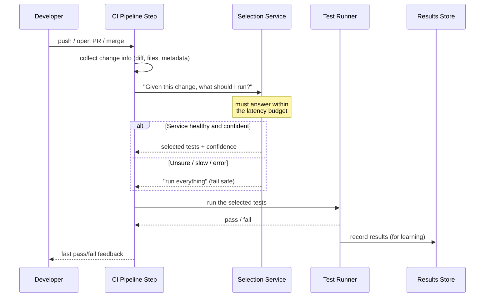

### Why this shape

- **The step is thin on purpose.** It gathers the change, calls the service, and runs what it is told. All the hard logic is server-side, so we improve models without asking every customer to upgrade their pipeline.
- **The contract is small.** "Here is a change, here is what to run." That keeps it portable across CI systems and easy to reason about.
- **Fail-safe is built in.** If the service is slow or errors, the step runs the full suite. The pipeline never breaks because of us.

---

## 7. End-to-End Architecture

The e2e picture across the *fast serving path* and the *slow learning path*.

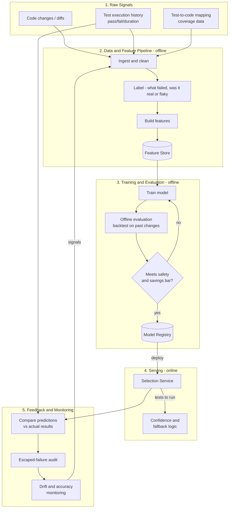

The serving plane runs on a fast clock, milliseconds to seconds, in the critical path. The learning plane runs on a slow clock, hours to days, offline. Keeping them separate is a core choice. Slow training work never blocks a fast selection decision.

---

## 8. Data and Curation

Models are only as good as the data behind them. This section turns raw, messy signals into training examples we can trust.

### The raw signals

1. **Code changes.** The diff for each change: which files, which lines, added or removed, plus metadata such as author, message, size, and timing.
2. **Test execution history.** For every past run: which tests ran, pass or fail, and how long they took. At scale this is billions of records.
3. **Test-to-code mapping.** Which code each test exercises, from coverage data, dependency analysis, or observed behaviour. This connects what changed to what tests touch it.

### Turning runs into labels

We want to predict: for this change, would test `t` fail? So each training example is a `(change, test)` pair labelled failed or passed.

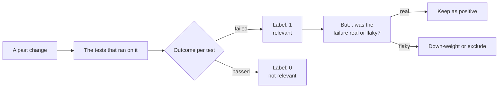

### The two big data problems

**Problem 1: extreme imbalance.** Almost every `(change, test)` pair is a pass. Real failures are rare. Train naively and the model just predicts pass, which is useless.

What we do: rebalance the data (keep all failures, sample the passes) and weight errors asymmetrically, so missing a failure costs far more than running an extra test. That puts our safety-first objective straight into the maths.

**Problem 2: flaky failures pollute the labels.** A flaky test fails for reasons unrelated to the change. Label it "the change caused this" and we teach the model nonsense.

What we do: use Test Engine's existing flaky-test detection to spot and down-weight or exclude flaky failures from the causal signal. Building this inside a platform that already detects flakiness is a real advantage.

### Why curation beats model choice

A fancy model on noisy labels loses to a simple model on clean labels. Most of the leverage here is in the data pipeline, not the algorithm. Clean, de-flake, balance, and respect time. That is where trust is earned. See [Appendix A](#appendix-a-avoiding-data-leakage) for the subtle pitfall, time-based leakage.

---

## 9. Feature Engineering and Multi-Language Coverage

Features are what the model actually looks at. We group them into three families, ordered from cheapest and most general to richest and most specific.

| Family | What it captures | Examples |
|---|---|---|
| **Diff features** | What changed | Which files and how many, lines added and deleted per file, directory depth of changed files, whether a changed file is itself a test, file type, and whether a dependency manifest changed (`requirements.txt`, `Gemfile`, `package.json`) |
| **Test history features** | What usually happens to this test | Failure rate over the last N runs, time since last failure, flakiness score (variance of pass and fail over a rolling window), average execution time, test age |
| **Co-change features** | How change and test connect | The co-change score: how often this test has failed when these specific files changed in the past. Computed from a file-to-test graph with time-decayed edges. This is usually the strongest single signal |

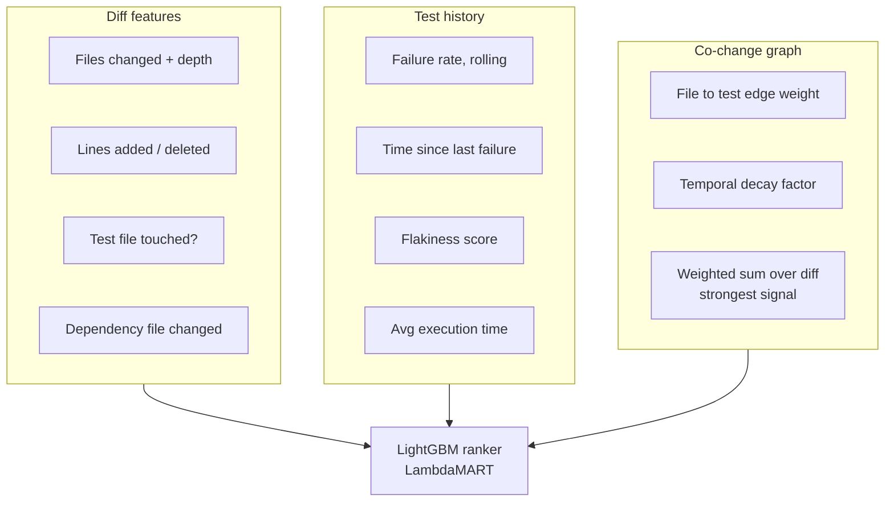

### Multi-language coverage

We cannot hand-build deep parsers for every language on day one. So the design has two layers.

| Layer | What it is | Coverage |
|---|---|---|
| **Language-agnostic core** | Signals that work for any text-based code: files changed, diff size, directory structure, and above all historical co-failure, which does not care about language | Works everywhere, immediately |
| **Per-language adapters** | Optional plug-ins that parse imports, functions, and symbols for one language | Added incrementally, highest-value languages first |

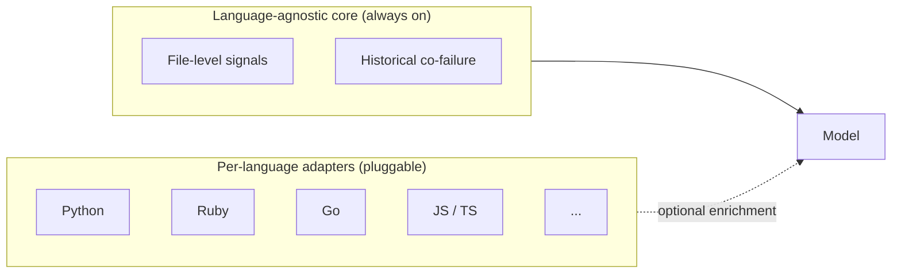

The core gives broad coverage right away, since history-based signals are strong on their own. Adapters then deepen accuracy language by language. We never block "works everywhere" on "works perfectly for one language." The trade-off: the core is less precise than deep per-language analysis but generalises, while adapters add precision at the cost of per-language work. We add them based on the customer language mix, not alphabetically.

---

## 10. The ML Approach and Its Trade-offs

### Why this is ranking, not classification

The instinct is to treat each test as a yes or no question: will it fail for this change? That is binary classification. It is the wrong frame here for two reasons.

First, what the CI runner actually needs is an ordered list. Given a change, put the tests most likely to fail at the top, then run down the list until we hit a budget. That is a ranking task, not a per-test verdict.

Second, a classifier forces an arbitrary probability threshold per repo, and that threshold is brittle. A ranker skips the threshold and optimises the order directly, which is exactly the thing we care about: the failing tests should sit near the top. The business then chooses how far down the list to run.

So we frame it as **learning to rank**: order the tests by predicted failure likelihood and run down the list until the budget is hit.

### Two stages: retrieve, then rank

A large suite can hold thousands of tests, and scoring every one on every change is wasteful and slow. We use the two-stage shape that search and recommendation systems use.

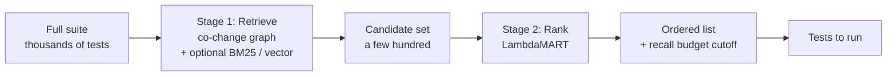

**Stage 1, retrieval.** From the full suite, cheaply narrow to a candidate set of a few hundred tests plausibly related to the change. The main signal is the co-change graph: tests with an edge to a changed file. Two cheap text signals can widen recall, BM25 lexical overlap between the diff and a test, and vector similarity for semantic matches. Retrieval is judged on recall, it must not drop a test that would fail.

**Stage 2, ranking.** A LambdaMART model scores only the candidates and orders them by failure likelihood. The recall budget sets the cutoff. Ranking is judged on getting the order right.

Splitting the work keeps retrieval cheap enough for the latency budget and keeps ranking precise, because it runs on a short list rather than the whole suite.

### X and Y

The training unit is a `(commit, test)` pair. One row per pair.

| | What it is | Where it comes from |
|---|---|---|
| **Y, the label** | Did this test fail for this commit? A simple yes or no | Historical CI runs we already store |
| **X, the features** | The three groups from section 9: diff features, test history features, and the co-change score | Computed from the diff, the test's past, and the file-to-test graph |

A "query group" in ranking terms is one commit. The model learns to order the tests within each commit, which mirrors exactly what happens at inference time.

### The co-change graph, the signal that usually wins

Most of the predictive power comes from one engineered feature, so it is worth its own explanation.

We build a graph linking files to tests. Every time a test fails after a file changed, we add or strengthen an edge between that file and that test. Edges decay over time, so recent co-failures count more than ancient ones. For a new change, each test gets a co-change score equal to the weighted sum of edges from the changed files to that test.

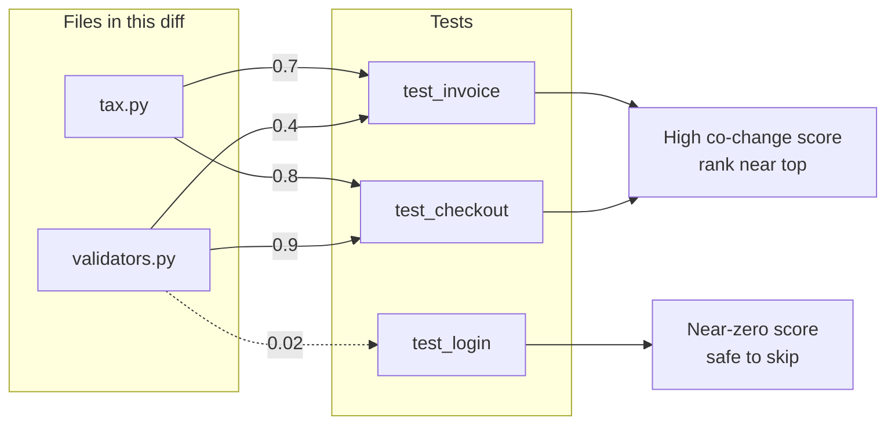

In plain terms, the graph captures what actually fails together from real history, including the indirect links a folder rule or import graph would miss. A shared utility that quietly breaks a checkout test shows up here even though the two files share no name or directory.

### The model: LightGBM with a LambdaMART objective

Our default production model (Level 1) is **gradient-boosted decision trees trained with LambdaMART**, using LightGBM.

LambdaMART is a boosted-tree method whose objective optimises ranking quality rather than per-row accuracy. It learns to push the items that should rank high (the failing tests) toward the top of each commit's list. That objective lines up directly with our goal of catching failures inside a small test budget.

| Why it fits | What it means in practice |
|---|---|
| **Tabular and sparse data** | The features are a mix of counts, rates, and one dominant graph score. Boosted trees are the strongest off-the-shelf model for this shape of data |
| **Ranking objective** | LambdaMART optimises the order, which is recall at a given test budget, the exact thing we sell |
| **Fast inference** | Scoring a few thousand tests takes milliseconds, which the under-two-second budget demands |
| **Interpretable** | Feature importances tell us why a test ranked high, which we can show a customer |
| **Cheap to retrain** | Retraining is quick, so the feedback loop in section 14 stays tight |
| **Fits our stack** | LightGBM is mature, well understood, and easy to operate |

### One shared model, two kinds of features

The JD asks for a generalised solution that works across codebases, frameworks, and languages. That requirement settles the model architecture. We use a **single shared model whose features are split into two kinds**, rather than one model per tenant or one flat global model.

Why not the two extremes:

| Approach | Why it fails |
|---|---|
| **Purely global model** | Test-failure patterns are repo-specific. Whether a changed file breaks a given test is a fact about one codebase, not a universal law. A flat global model learns average behaviour, over-fits to large data-rich tenants, and serves everyone else poorly |
| **Purely per-tenant model** | Gives no savings until a tenant has weeks of CI history, and means training and serving thousands of separate models, which does not scale |

The shared model gets the best of both through its features:

| Feature kind | What it captures | Examples | Available |
|---|---|---|---|
| **Global features** | Universal patterns that transfer across every codebase, no repo-specific history needed | Diff size, file centrality, dependency-manifest changes, test flakiness signals | From day one, every tenant |
| **Tenant-scoped features** | The repo-specific signal, unique to each codebase | The co-change score, test A has historically broken when file B changed | Accrues as the tenant's CI history grows |

A new tenant gets useful global signal immediately, so savings start on day one. Tenant-scoped signal fills in over time and sharpens accuracy for that codebase. One model, trained on pooled feature-level data across tenants, satisfies the generalisation requirement while still learning what matters most for each individual repo. Isolation of raw code and each tenant's private co-change graph is covered in section 15. Cold start is covered in section 17.

### Training data and the leakage trap

Rows are `(commit, test)` pairs, grouped by commit. The single most important rule is how we split them.

> **Split by time, never at random.** The test set must be the most recent block of commits. A random shuffle leaks future co-change patterns into training and produces offline numbers that look great and then collapse in production.

This is the same point as Appendix A, and it matters most here because the co-change graph is built from history. If training can see the future, the graph feature becomes a cheat sheet.

### Turning a ranking into a decision: the recall budget

The ranker gives an ordered list. A single configurable dial, the **recall target**, turns that into "run these tests, skip the rest."

| Recall target (failures caught) | Roughly how much of the suite runs | Who picks this |
|---|---|---|
| 99% | About 60% | Merge to main, release branches |
| 95% | About 30% | Most teams, the common sweet spot |
| 85% | About 10% | Fast inner loop while developing |

The numbers are illustrative, but the shape is the point. The curve [above](#what-good-looks-like) plots how many failures we catch (recall, the vertical axis) against how much of the suite we run (the horizontal axis).


### The options we considered, simplest first

We build up in levels. Each level is a real, shippable system, and we only move up if it beats the level below on the metrics.

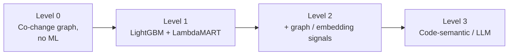

| Level | What it is | Why choose it | The cost |
|---|---|---|---|
| **0. Co-change graph heuristic** | Score tests by weighted edges to the changed files, rank, apply a threshold. No training | Interpretable, no training infrastructure, works on day one, easy to explain. Doubles as the cold-start fallback | No generalisation, blind to patterns beyond direct co-change, weak on sparse history |
| **1. LightGBM with LambdaMART (recommended v1)** | A single shared model with global and tenant-scoped features. Co-change score plus diff and test-history features | Strong performance, handles sparse signals, millisecond inference, interpretable, easy to retrain, ranking objective targets recall at a budget. Global features give every new tenant a useful baseline from day one | One model to operate, but it must serve many tenants well, which the two-level feature split handles |
| **2. Graph and embedding signals** | Learned representations of the dependency graph and code areas, added as features | Captures relationships hand-crafted features miss, better on cross-cutting changes | More infrastructure, harder to interpret, more to maintain |
| **3. Code-semantic model (embeddings or LLM features)** | Embed diffs and tests with a code model to capture meaning, fed in as offline features | Helps where history and structural features are too thin, such as brand-new code paths | Much higher infrastructure cost and latency, must stay offline, and the semantic gain may not justify it |

> **Recommendation:** ship Level 1 (LightGBM LambdaMART) as v1, a single shared model with global and tenant-scoped features, with the co-change graph driving retrieval and acting as the strongest tenant-scoped ranking feature. Keep the Level 0 co-change and coverage heuristics as the deeper cold-start fallback. Starting with trees is about latency, operability, and time to value, and the data already exists at Buildkite scale, so this is buildable now. Defer Level 3 because reading code meaning is a separate gain that has to beat its latency and infrastructure cost.

### Optional later: vector search in retrieval (v2)

Vector similarity over code embeddings is an optional Stage 1 retrieval signal, not a v1 requirement. It helps in two cases: a new repo or code path with no co-change history, and very large codebases where matching by meaning narrows the candidate set better than graph edges alone. It improves recall at a given budget. It is not a safety mechanism, the safety margin and fallback still own safety.

It stays off the critical path. Embeddings are computed offline and stored per tenant, preserving isolation. At request time we embed only the small diff and do one approximate-nearest-neighbour lookup, which is fast. We do not fine-tune a model per customer, embedding plus retrieval gives the signal without that cost.

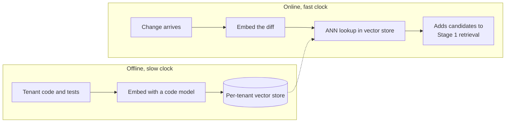

### The key modelling decision: *the safety margin*

Whatever the model, we do not only run the predicted-to-fail tests. We run those plus a safety margin: extra tests where the model is uncertain, plus a small always-on random sample that keeps us learning and catches blind spots. The size of that margin is the dial that sets where we sit on the safety and savings curve. It is driven by the agreed safety target, monitored continuously, and adjusted deliberately.

---

## 11. Serving and Inference

The serving layer is where the model meets the critical path. Its job is to answer "what should I run?" fast, and degrade gracefully when it cannot. The request path is a short pipeline.

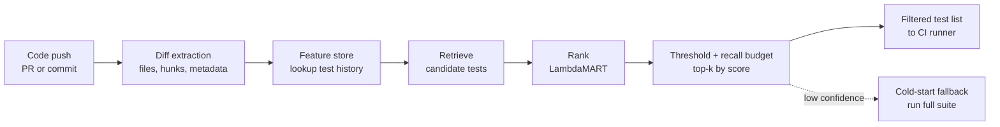

The whole path runs inside the latency budget, likely under two seconds, because it gates the start of the test run.

### The latency budget

Selection must be much faster than the time it saves. If a build takes 60 minutes and selection saves 50 of them, spending 5 to 10 seconds to decide is a great deal. Spending 5 minutes is not. So we set a hard latency budget and design to it.

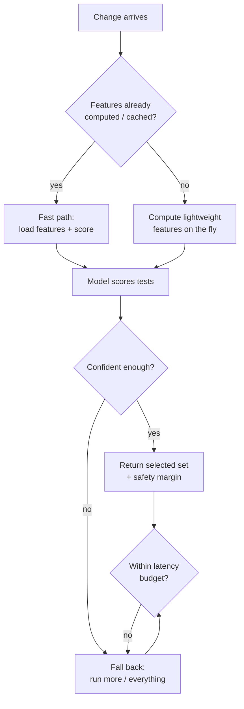

### How we hit the budget

- **Pre-compute what we can.** Slow, stable signals such as history features, the dependency graph, and test stats are computed offline and cached. At request time we only do cheap, change-specific work.
- **Keep the online model light.** Another reason to prefer fast models (Level 1) for serving.
- **Time-box the request.** If we cannot answer in time, we do not hold up the build. We fall back to running more tests. The latency budget is itself a safety mechanism.

---

## 12. Evaluation: Offline and Online

We never trust a model because it looks good. We prove it offline, then prove it again carefully in production. Evaluation is where safety is earned.

### Offline: backtesting on history

Before a model goes near production, we replay the past. Take historical changes, ask the model what it would have selected, and compare against what actually failed.

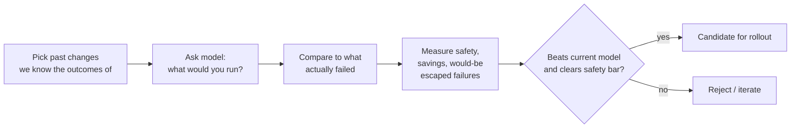

### The metrics!

These are the named metrics the whole system is judged on. Every one is computed offline during backtesting and again live in production, so the numbers mean the same thing end to end.

| Metric | How we compute it | Target | Role |
|---|---|---|---|
| **Recall on failures (safety)** | failing tests we selected / all failing tests | At or above the agreed floor, commonly 95 to 99% | Hard release gate |
| **Escaped-failure rate** | failing tests we skipped / all failing tests, which is 1 minus recall | Near 0 | Hard release gate, paged if it rises |
| **Selection rate** | tests we ran / total tests in the suite | As low as the recall floor allows | Monitor |
| **Savings** | 1 minus selection rate | As high as possible | The business headline |
| **Selection latency** | time from change received to test list returned, tracked at p50, p95, p99 | p95 under 2 seconds | Hard gate, it sits in the critical path |
| **Coverage** | changes we confidently selected for / all changes | Rising over time | Monitor, shows how often we still fall back |
| **CI time saved** | full-suite wall-clock minus selected wall-clock | Positive and growing | Business value |
| **Drift** | distance between recent input or accuracy and the training baseline | Below an alert threshold | Triggers retraining |

The first two are the trust metrics and they gate every release. Savings and CI time saved are what the customer feels. Latency is the constraint that keeps us honest.

> **Note:** backtesting must respect time. We only ever train on data from before the change we are testing. Otherwise we peek at the future and the offline numbers become a lie. See [Appendix A](#appendix-a-avoiding-data-leakage).

### Report per language, not just one global number

A single headline number is dangerous. A model can show 96% recall overall while quietly leaking failures in one language, because a strong language with lots of data hides a weak one. Since generalising across languages and frameworks is the core goal, we slice every metric above by language and by test framework.

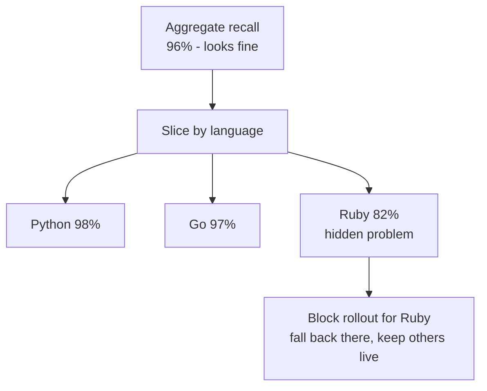

Two rules follow from this:

- **Report always.** Dashboards and customer reports show a per-language and per-framework scorecard, never only the average.
- **Gate on what the customer runs.** A release is gated on the languages a given customer actually uses. A regression in Ruby blocks selection for Ruby and falls back to the full suite there, while Python and Go stay live. We never let one healthy language carry a broken one into production.

Example scorecard (illustrative):

| Language | Recall | Escaped-failure rate | Savings | Status |
|---|---|---|---|---|
| Python | 98% | 0.4% | 71% | Live |
| Go | 97% | 0.6% | 68% | Live |
| Ruby | 82% | 4.1% | 60% | Held, full-suite fallback |
| JS / TS | 95% | 1.2% | 64% | Live |

### Online: proving it in production, safely

Offline looks good? We still roll out in stages, so a mistake can never hurt a customer.

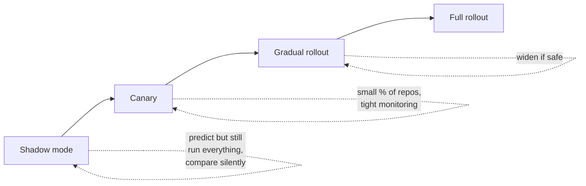

1. **Shadow mode.** The model predicts but we still run the full suite. We compare what it would have skipped against what actually failed, getting real-world safety numbers at zero risk.
2. **Canary.** Turn on real selection for a small, low-risk slice, with tight monitoring and instant rollback.
3. **Gradual rollout.** Widen coverage only while safety holds.
4. **Full rollout** with continuous monitoring.

### The always-on safety audit

Even at full rollout, we keep a small random sample of skipped tests running anyway, in the background or on a delay. That lets us measure escaped failures in production continuously, catching any test we would have wrongly skipped. It is a small ongoing cost that buys permanent, honest visibility into safety. It is not optional. It is how we keep trust.

---

## 13. Failure Modes and Fallbacks

The rule again: when in doubt, run more, never fewer. We fail safe, never open.

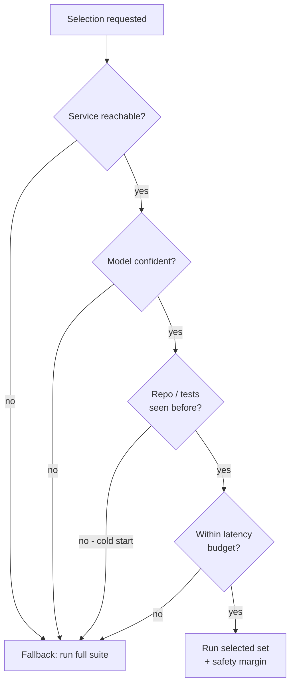

| Failure mode | What could go wrong | Our response |
|---|---|---|
| **Service down** | Selection API unavailable | Run the full suite. Builds never depend on us being up |
| **Low confidence** | Model is unsure for this change | Run more or everything. Uncertainty means caution |
| **Cold start** | New repo or test, no history | The shared model's global features give a day-one prediction, then the coverage heuristic and full suite as deeper fallbacks. See [section 17](#17-the-cold-start-problem) |
| **Latency exceeded** | Selection is taking too long | Abandon and run the full suite. Speed is a constraint, not best effort |
| **Model regression** | A new model is silently worse | Caught by monitoring and the safety audit, then auto-rolled back to the previous model |
| **Data pipeline broken** | Features stale or wrong | Caught by data-quality checks. Serve the last good model or fall back, and alert |

Every fallback costs the same and it is acceptable: we run more tests than strictly needed. That wastes some compute but never costs correctness. Cheap failure on one side, costly failure only if we are unsafe on the other. That asymmetry is the backbone of the design.

---

## 14. Feedback Loops and Continuous Improvement

The system improves the more it runs, because every build is a labelled example of "this change produced these outcomes."

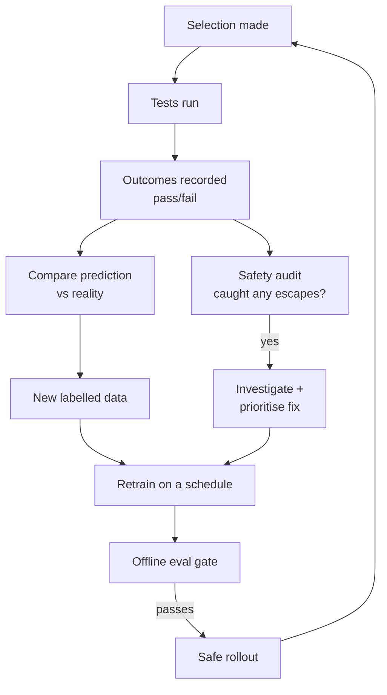

### What drives improvement

- **Fresh labels every build.** Each run tells us whether our prediction was right, feeding the next model.
- **Escaped-failure analysis.** When the safety audit catches a test we wrongly skipped, that example is the most valuable kind we have, so it is weighted heavily in retraining.
- **Scheduled retraining behind a gate.** We retrain regularly, but nothing ships without passing the offline gate and a staged rollout. Automation makes it repeatable. The gate keeps it safe.

### Drift

A codebase keeps changing: new modules, new patterns, new tests. A model trained on last quarter's code can quietly go stale. We watch for drift, when incoming data or model accuracy moves away from what we trained on, and trigger retraining or fallback when it does. See [Observability](#16-observability-and-monitoring).

---

## 15. Scalability

The system serves many customers, many repos, and billions of test runs. Scalability is designed in along a few axes.

| Axis | The challenge | The approach |
|---|---|---|
| **Multi-tenant** | Thousands of repos, all different | One shared model with global and tenant-scoped features. Shared infrastructure, per-tenant isolated data, no raw code shared across tenants |
| **Data volume** | Billions of historical runs | Heavy lifting (ingest, features, training) runs offline in batch on scalable data processing. Serving only touches small, cached, per-request data |
| **Serving load** | Builds arrive in bursts | A stateless, horizontally scalable service. Pre-computed features keep per-request work tiny |
| **Growing test suites** | Suites get bigger over time | The bigger the suite, the more there is to save. Selection scales with the value it provides |
| **Adding languages** | More languages over time | The pluggable adapter model in [section 9](#9-feature-engineering-and-multi-language-coverage) adds languages without re-architecting |

The two-clock split, fast serving and slow learning, is the key scalability decision. Expensive work happens offline and is amortised, so the online path stays cheap no matter how much history we hold.

### Multitenancy for enterprise customers

Enterprise customers care as much about isolation as speed. One customer's raw code, test history, and private co-change graph must never be visible to another. We run **one shared model**, but each tenant's data and tenant-scoped features stay isolated, and only non-identifying feature-level data is pooled to train the shared model.

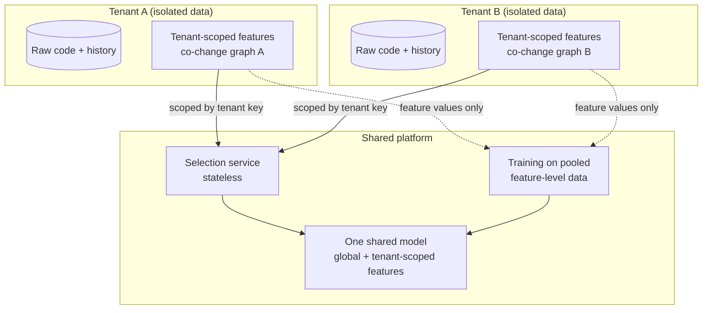

| Concern | How we handle it |
|---|---|
| **Data isolation** | Each tenant's raw code, history, and co-change graph live in a per-tenant namespace. Every request carries a tenant key, and queries are scoped to it. No cross-tenant reads |
| **What is shared vs private** | The shared model trains on pooled feature-level data, which is standard and isolation-safe. Raw code, test names, and each tenant's private co-change graph are never exposed to another tenant |
| **Tenant-scoped features stay private** | A tenant's co-change scores and history are computed only from that tenant's data and only ever feed predictions for that tenant |
| **Noisy neighbour** | The serving layer is stateless and horizontally scaled, with per-tenant rate limits so one busy customer cannot starve another |
| **Data residency** | Enterprise tenants can be pinned to a region (for example an AWS region) to meet residency and compliance needs |
| **Security** | Encryption in transit and at rest, scoped credentials, and audit logs of who accessed what |

This is the deliberate balance the JD's generalisation requirement asks for. One shared model learns universal patterns from global features, so a new tenant gets value on day one, while tenant-scoped features keep each codebase's specific signal private and personal. No customer's code or private relationships are ever exposed to another. All training is offline and amortised.

---

## 16. Observability and Monitoring

We cannot keep a system safe if we cannot see it. Every production model is instrumented with these signals.

| Signal | Question it answers | Why it matters |
|---|---|---|
| **Prediction accuracy** | Are predictions matching reality? | Early warning of a bad model |
| **Latency** | Are we within budget? | We sit in the critical path |
| **Coverage** | What percent of changes are we confidently selecting for? | Shows where we still fall back |
| **Escaped-failure rate** | Are we missing real failures? | The trust metric, watched most closely |
| **Savings** | How much are we actually saving? | The business value delivered |
| **Drift** | Has the data shifted? | Triggers retraining before accuracy slips |

These feed dashboards and alerts with clear thresholds. Every signal is sliced by language, framework, and tenant, not just reported as one global number, for the reasons in [section 12](#12-evaluation-offline-and-online). A rise in escaped failures is a safety incident. It can trigger automatic rollback or a shift to more conservative selection while we investigate. The system should protect its own safety automatically, before a human is paged.

---

## 17. The Cold-Start Problem

Cold start is deciding well with little or no history for a tenant: a new repo, a new test, or a language we have barely seen. The shared model's global features carry most of the load here, so a new tenant gets a useful prediction immediately, then improves as its tenant-scoped signal accrues.

```mermaid
flowchart TB
    A[New prediction request] --> B[Shared model<br/>global features work day one]
    B --> C{Confident enough?}
    C -->|yes| R[Return ranked,<br/>filtered test list]
    C -->|no| E{Coverage / import<br/>data available?}
    E -->|yes| F[Coverage heuristic:<br/>run tests importing<br/>the changed files]
    E -->|no| G[Full suite fallback<br/>safe, no failures missed]
    R --> H[Actual CI outcomes<br/>feed back as labels]
    F --> H
    G --> H
    H -.->|"tenant-scoped features sharpen as history accrues"| B
```

The tiers, most to least informed:

| Tier | When it runs | Behaviour |
|---|---|---|
| **Shared model, global features** | Always, from day one, even with no tenant history | A useful baseline prediction from universal patterns like diff size, file centrality, and flakiness |
| **Shared model, plus tenant-scoped features** | The tenant has accrued co-change history | Full strength, the co-change signal sharpens accuracy for that codebase |
| **Coverage heuristic** | Model confidence is low and static coverage or import data exists | Run the tests that import the changed files. No training needed |
| **Full suite** | Nothing else applies | Run everything. Always safe, never misses a failure |

How we handle it:

- **Value on day one.** Global features give a new tenant a useful prediction immediately, with no repo history required. This is what satisfies the generalisation requirement.
- **Default to safe.** When confidence is low we run the coverage heuristic or the full suite. We never gamble on a repo we do not understand.
- **Sharpen over time.** Every run produces labels and builds the tenant's co-change graph. Tenant-scoped features then lift accuracy for that codebase, and savings improve.

This is why the system is valuable but humble early. A new customer gets useful selection immediately and savings that grow as it learns their codebase.

---

## 18. MVP and Phased Roadmap

We build in stages. Each stage ships and proves value before we add complexity. The roadmap mirrors the ladder in [section 10](#10-the-ml-approach-and-its-trade-offs).

```mermaid
flowchart LR
    P0[Phase 0 - Crawl<br/>Measure + baseline] --> P1[Phase 1 - Walk<br/>First model in shadow]
    P1 --> P2[Phase 2 - Run<br/>Real selection, staged]
    P2 --> P3[Phase 3 - Scale<br/>Generalise + harden]
```

| Phase | Goal | What we build | Gate to proceed |
|---|---|---|---|
| **0. Crawl** | Understand the data, set the bar | Ingestion and labelling pipeline, the heuristic baseline (Level 0), an offline backtest harness | We can measure baseline safety and savings honestly |
| **1. Walk** | First real model, zero risk | Level 1 shared model with global and tenant-scoped features, retrieve-then-rank, feature store, shadow mode in production, the pipeline-step integration | Model beats baseline offline and in shadow on safety and savings |
| **2. Run** | Deliver real savings, safely | Real selection behind canary then gradual rollout, fallback logic, safety audit, monitoring and alerts | Safety holds in production, savings are measurable, rollback is proven |
| **3. Scale** | Sharpen and harden | Vector search in retrieval and code-semantic features (Level 3) where they pay off, more language adapters, automated retraining, drift handling | Semantic gains proven against their cost, retraining repeatable, drift handled automatically |

> **Why phased:** it de-risks the work and earns trust step by step. Shadow mode gives real safety evidence before any customer is exposed. Each phase has a clear gate, so we advance on measured results, not optimism.

---

## 19. Risks and Open Questions

An honest account of what could go wrong or is still undecided.

| Risk or question | Why it matters | How we would handle it |
|---|---|---|
| **Setting the safety floor** | Too strict saves nothing, too loose loses trust | Set it deliberately with the business, start conservative, tighten savings only as evidence grows |
| **Flaky failures corrupting labels** | Teaches the model wrong causes | Use flaky-test detection, down-weight or exclude, monitor label quality |
| **Time leakage in evaluation** | Inflated offline numbers that do not hold up | Strict time-ordered backtests (Appendix A), with shadow mode as the real check |
| **Cold start frustrating new users** | Early value is limited | The shared model's global features give day-one value, tenant-scoped features sharpen it over time, set the expectation that savings grow |
| **Latency creeping up as suites grow** | Could erode the value proposition | Pre-compute and cache, keep serving models light, hard time-box with fallback |
| **Over-engineering the model early** | Wasted effort, harder to operate | Use the ladder, only climb when evaluation justifies it |
| **Trust after any escaped failure** | One bad miss can lose a customer | Always-on safety audit, transparent reporting, fail-safe defaults |

---

## 20. Appendices

### Appendix A: Avoiding Data Leakage

The most dangerous, easy-to-miss bug here is time leakage: using information from after a change to predict that change. It makes offline results look fantastic and then collapse in production.

The rule: when we evaluate or train for a change at time `T`, we may only use data available before `T`. Past test results, past co-failures, and the dependency graph as it was then. Never the future.

```mermaid
flowchart LR
    A[Past data<br/>before T] -->|allowed| M[Model decision at T]
    B[Future data<br/>after T] -.forbidden.-> M
```

We enforce this with time-ordered splits in backtesting and feature computation, and we treat shadow mode as the ultimate honesty check, because in shadow mode the future genuinely has not happened yet.

### Appendix B: Metric Definitions

For a change, let `F` be the tests that actually failed and `S` the tests we selected to run.

- **Safety (recall on failures)** = (failures we selected) / (all failures) = `|F ∩ S| / |F|`. Target near 1.0. This is the headline trust metric.
- **Selection rate** = `|S| / |T|`, the fraction of the suite run. Savings = 1 minus selection rate.
- **Escaped failures** = `|F \ S|`, the failures we skipped. Target near zero.
- We deliberately do not chase precision (running only failing tests) at the cost of safety. A few extra passing tests cost compute. A missed failure costs trust.

### Appendix C: Feature Catalogue

| Family | Example signals | Needs history? | Language-specific? |
|---|---|---|---|
| Diff | files changed and depth, lines added or deleted, test file touched, dependency file changed | No | No (core) |
| Test history | failure rate, time since last failure, flakiness score, average execution time, test age | Yes | No |
| Co-change | file-to-test edge weight, temporal decay, weighted sum over the diff | Yes | No |

### Appendix D: Why LightGBM with LambdaMART as the Default

- **Tabular and sparse data.** The feature space is many weak signals plus one dominant co-change score, the regime where boosted trees consistently beat both linear models and deep nets.
- **A ranking objective.** LambdaMART optimises the order of tests within a commit, which is recall at a test budget, the exact thing we sell. A plain classifier would optimise per-test accuracy and need an arbitrary threshold.
- **Latency.** Inference is cheap and predictable, which the critical path demands.
- **Interpretability.** Feature importance and per-decision explanations let us answer "why this test?", which matters for trust and debugging.
- We revisit this only when offline evaluation shows a more complex model, such as cross-repo embeddings, moving the safety and savings curve enough to justify the added operational cost.

---


### Quickstart for this repo.

- Install `mise`.

```bash
brew install mise
```

- Activate `mise` in your shell.

```bash
mise activate zsh
```

Or, add `eval "$(mise activate zsh)"` to your shell config (e.g. `~/.zshrc`) to
avoid having to run the activation command manually each time.

- Install prerequisite tools and pin versions managed by `mise`.

```bash
mise up
```

- Sync Python versions across `pyproject.toml` and `.python-version` files.

```bash
make sync-py-versions
```

- Setup Local Environment. We use [uv](https://docs.astral.sh/uv/) to manage our
  Python virtual environment and dependencies. To set up this repo and get
  started quickly, run the following,

```bash
make setup-local-env
```

This command will:

- Create a Python virtual environment (`.venv`) under the project directory.
- Install all required dependencies as specified in `pyproject.toml`.
- Set up pre-commit hooks defined in `.pre-commit-config.yaml` for code quality
  checks.

Thereafter, python commands can be run using `uv run python <script_name>.py` to
ensure they execute within `.venv`.

Other useful Makefile targets:

- `make add-group-deps` — adds dependency
- `make remove-group-deps` — removes dependency

Refer to the `Makefile` for more details.
